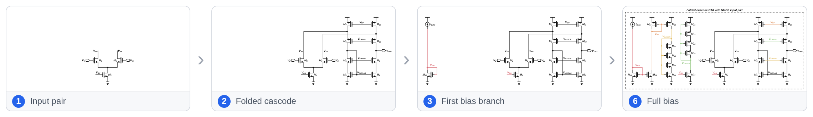
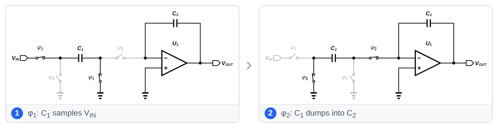

<p align="center"></p>

<h1 align="center">Mosfeteer</h1>

<p align="center">A keyboard-driven editor for textbook-style analog schematics, with assisted wiring, presentation beats, and symbolic small-signal analysis.</p>


## Symbolic analysis

Pick the input and output nets to derive `Z_in`, `Z_out`, `A_v`, and any poles and zeros, simplified the way a textbook would. Hover or click any term to light up the devices it comes from, then annotate the schematic with the results.


## Fast editing

Press `i` and type to insert a part. Assisted wiring lays each wire out on the grid around the parts as you draw it, and keeps it tidy when parts move. Design Check (`x`) catches dangling pins, overlapping text, and off-grid geometry. Press `?` for every shortcut.


| Persistent net highlights (`9`) | Right-drag a part for quick actions |
| :---: | :---: |
|  |  |

## Beats

Beats are presentation steps over one drawing: each shows, dims, or hides parts, sets switch positions, and highlights nets, without copying anything. Build a figure up step by step (`Shift+B`, then `+`), present it full screen (`Shift+F5`), or export every beat as numbered files that line up.



Label switches with the phase that drives them, and **Beats from switch phases** (More menu) adds one beat per phase: its switches closed, the others open, and whatever the open switches cut off dimmed.



## Symbols

Analog, digital, and mixed-signal symbols share one textbook style, plus resizable blocks and signal-flow nodes for block diagrams.


## Install and run

All you need is [Node.js](https://nodejs.org/) 18 or newer. There is nothing else to install.

```sh
git clone https://github.com/ojarvin/mosfeteer.git
cd mosfeteer
node launch.mjs
```

The editor opens in an app-style Chromium window, or your default browser. It stops by itself shortly after the last editor window closes. To add Mosfeteer to your application menu, run `node launch.mjs --install` once on Linux or macOS (run it again after a Node upgrade moves Node); on Windows, double-click `Mosfeteer.cmd`.

**No Node?** Open [`browser-only/index.html`](browser-only/index.html) directly. It is the same editor, using the browser's file pickers and downloads, without the CLI or PDF export.

## Documents

- Each schematic is a single `.json` file you can keep in a repository or share like any other file.
- New documents are saved to a workspace folder, `~/Documents/Schematics` by default. **Open** (Ctrl/Cmd+O) and **Save as** work with any folder.
- An open document with no unsaved changes reloads when its file changes on disk, for example after a `git pull`.
- **Export** (Ctrl/Cmd+E) writes SVG, PDF, and PNG, framed tightly around what is drawn. A page guide (IEEE single or double column) pads the export so its text lands at the paper's figure size.

## Scripting

The editor, the CLI, and the HTTP API all run the same command language:

```sh
npm run cli -- amp "add nmos M1 --at 120 120"   # edits <workspace>/amp.json
```

## Development

```sh
npm run serve   # dev server with auto-restart (http://127.0.0.1:47280/)
npm test
```

- [`AGENTS.md`](AGENTS.md): editor behavior and the symbol specification
- [`docs/beats.md`](docs/beats.md): how beats are stored and edited
- [`docs/circuit-spec.md`](docs/circuit-spec.md): deterministic circuit generation
- [`docs/topological-small-signal.md`](docs/topological-small-signal.md): how the analysis works

## License

[MIT](LICENSE). The vendored Latin Modern Math font in `src/web/fonts/` keeps
its own [GUST Font License](src/web/fonts/GUST-FONT-LICENSE.txt).
