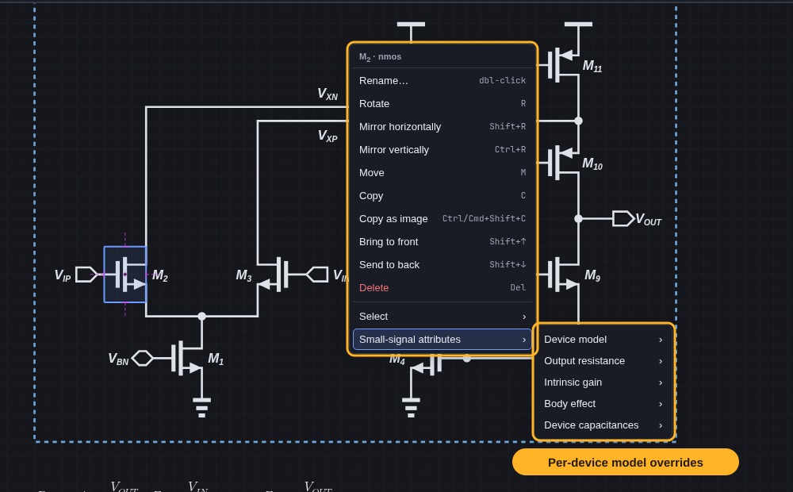

# Schematic Spawner

A keyboard-driven editor for textbook-style analog schematics and block diagrams, with auto-routed wires, symbolic small-signal analysis, and a CLI/HTTP interface for scripts and agents.


## Symbolic small-signal analysis

Pick input and output nets, and it derives `Z_in`, `Z_out`, `A_v`, poles, and zeros using textbook approximations. You can annotate the schematic with the results.


## Fast editing

| Fuzzy insert with symbol previews | Right-click actions and per-device overrides |
| :---: | :---: |
|  |  |

Press `?` in the editor for the full keyboard reference.

## Symbols


## Install and run

The only requirement is [Node.js](https://nodejs.org/) 18 or newer. There are no packages to install.

```sh
git clone https://github.com/ojarvin/schematic-spawner.git
cd schematic-spawner
./start.sh                  # or: node launch.mjs
```

To start it by double-clicking instead:

- **Linux:** run `node launch.mjs --install` once. *Schematic Spawner* then appears in your application launcher.
- **macOS:** double-click `Schematic Spawner.command`, or run `node launch.mjs --install` once to add *Schematic Spawner* to `~/Applications`.
- **Windows:** double-click `Schematic Spawner.cmd`.

The launcher starts a small local server and opens the editor in an app-style Chromium window, or in your default browser if Chromium isn't installed. The server only accepts requests from the editor on your own machine. It stops by itself shortly after you close the last editor window. Launching again while it's running reuses the same server.

## Documents and sharing

Each schematic or block diagram is one self-contained `.schematic.json` file. You can keep it anywhere and send it to anyone.

- **Workspace folder:** the document list shows this folder, and new documents are saved into it. The default is `~/Documents/Schematics`. Change it from the **⋯** menu, or start with `node launch.mjs <folder>`.
- **Open file…** (Ctrl/Cmd+O) and **Save as…** (Ctrl/Cmd+Shift+S) work with any folder, such as a project repository or a shared drive. Files opened from outside the workspace are listed under *Recent elsewhere*.
- **Drop** a `.schematic.json` file (for example, an email attachment) onto the window to open a copy. Saving it puts the copy in your workspace.
- If a file changes on disk (for example, after `git pull` or an edit by a coworker on a shared drive), an open document with no unsaved changes reloads automatically.
- `node launch.mjs path/to/amp.schematic.json` opens a document directly.
- **Export** writes SVG, PDF, and 4× PNG files into a folder you choose (by default, the document's own folder). PDFs are vector files printed by a Chrome, Chromium, Edge, or Brave install found on your machine; without one, the PDF contains the high-resolution image instead.

On first start, circuits from earlier versions of the app (`circuits/<name>/circuit.json` in this repository, and the former desktop app's user-data folder) are copied into the workspace. The originals are left in place.

## Development

```sh
npm run serve   # dev server with auto-restart on source changes (http://127.0.0.1:47280/)
npm test
```

Scripted editing goes through the CLI against a running server, for example `npm run cli -- amp "add nmos M1 --at 120 120"`. Here `amp` is `<workspace>/amp.schematic.json`.

## More

- [`AGENTS.md`](AGENTS.md): editor behavior and symbol specification
- [`docs/circuit-spec.md`](docs/circuit-spec.md): deterministic circuit generation
- [`docs/topological-small-signal.md`](docs/topological-small-signal.md): how the analysis works
- [`docs/block-diagram.md`](docs/block-diagram.md): block diagrams
