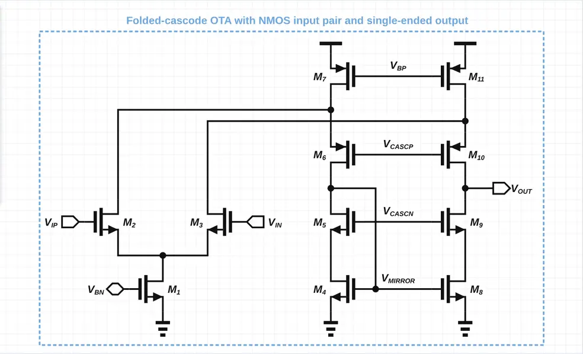
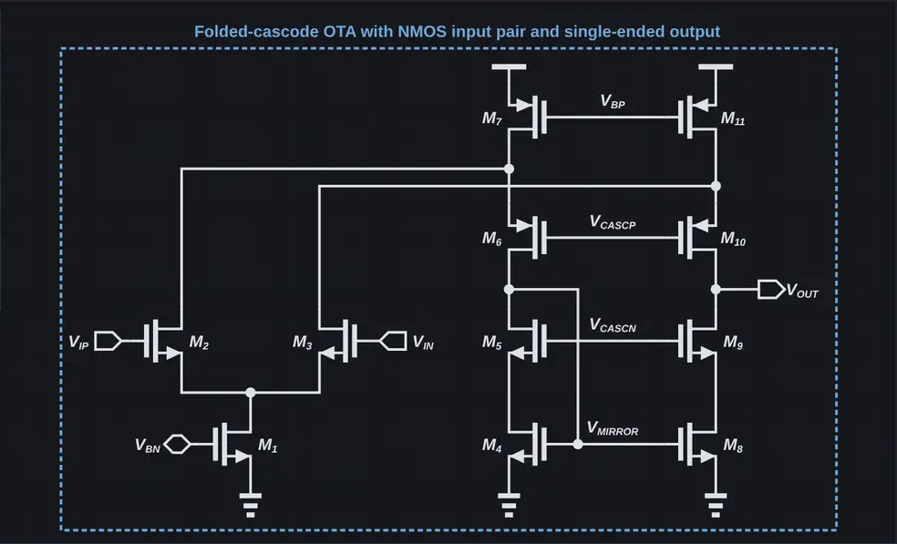

# Schematic Spawner

Schematic Spawner is a programmatic editor for electrical schematics and block diagrams. It combines separate document models, automatic routing where applicable, an interactive web editor, SVG rendering, and a CLI/API command interface. The shared editor clearly identifies the active document type and keeps electrical and block-diagram tools isolated.





## Quick start

```sh
npm install
npm run desktop
```

The desktop app supports Linux and macOS. On first launch it imports existing
repository circuits into Electron's per-user application data folder, and saves
each named document with its `circuit.json` and `circuit.svg` files there. The
Export dialog is separate from that internal storage: it asks once for an
external output location (Pictures by default) and can produce SVG, PDF, and
high-resolution 4× PNG files there, with independent grid and dark-mode
appearance options. It does not start an HTTP server. Press F5 to restart the
Electron application and reload all application processes; unsaved drafts are
preserved in the renderer’s local storage.
To package a distributable app, run `npm run desktop:package`.

For browser development and CLI/agent automation, keep using the HTTP server:

```sh
npm start
```

Open the URL printed by the server. Use the editor directly, or run commands through the CLI:

```sh
npm run cli -- add nmos M1 --at 120 120
```

Run the test suite with:

```sh
npm test
```

## Project layout

- `src/core/` — circuit model, symbols, routing, and SVG renderer
- `src/web/` — browser editor, persistence adapter, and HTTP server
- `src/desktop/` — Electron main/preload boundary and native workspace storage
- `src/cli/` — command-line client
- `test/` — Node.js test suite

## Deterministic generation

The circuit-author agent translates an approved electrical request into an
explicit CircuitSpec, then uses the CLI to preview and commit a generated
circuit. The editor has no natural-language generation tool and does not invoke
an AI provider. The deterministic API and workflow are documented in
[`guidelines/CIRCUIT-AUTHOR.md`](guidelines/CIRCUIT-AUTHOR.md) and
[`docs/circuit-spec.md`](docs/circuit-spec.md).
