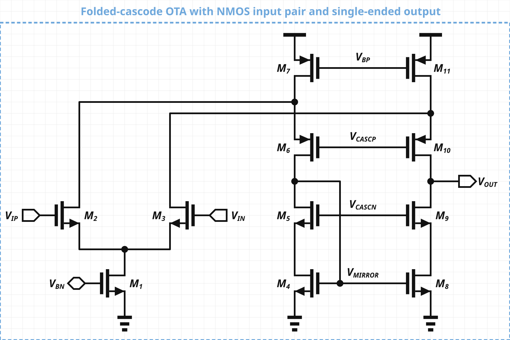

# Schematic Spawner

Schematic Spawner is a programmatic circuit schematic editor. It combines a connectivity-aware circuit model, automatic routing, an interactive web editor, SVG rendering, and a CLI/API command interface.



## Quick start

```sh
npm install
npm start
```

Open the URL printed by the server. Use the editor directly, or run commands through the CLI:

```sh
npm run cli -- add nmos M1 --at 120 120
```

Run the test suite with:

```sh
npm test
```

## Project layout

- `src/core/` — circuit model, symbols, routing, and SVG renderer
- `src/web/` — browser editor and HTTP server
- `src/cli/` — command-line client
- `test/` — Node.js test suite
