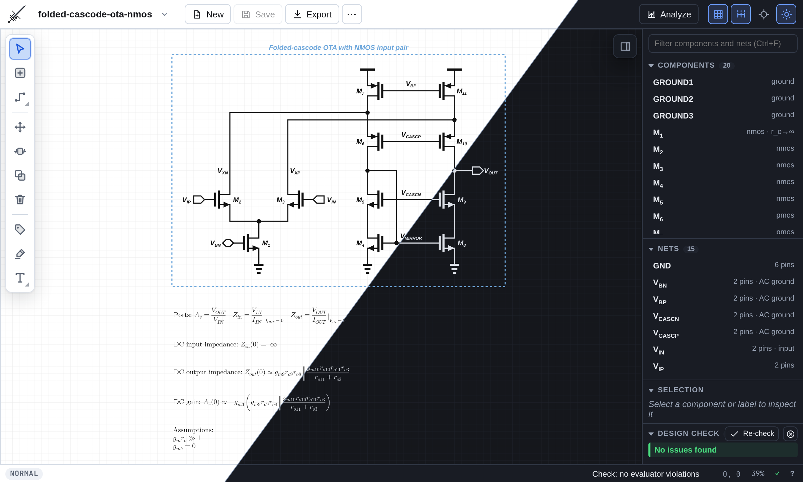
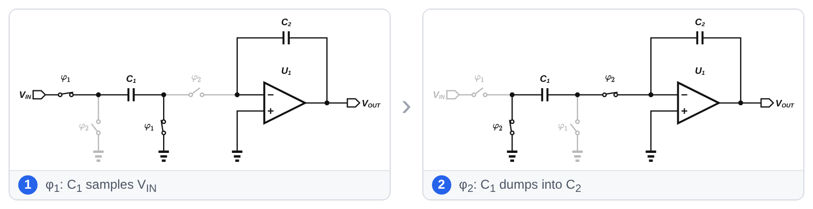
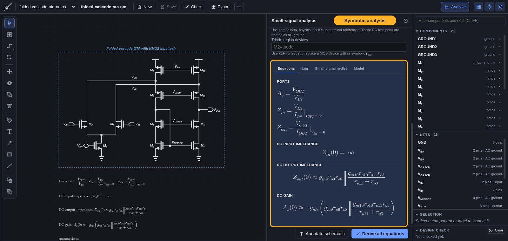
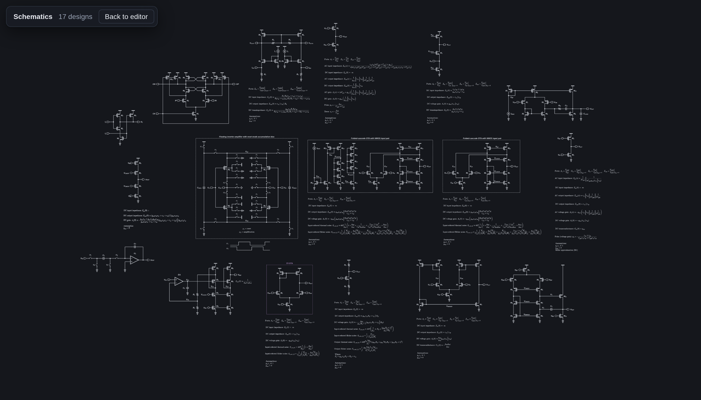

<p align="center"><picture><source media="(prefers-color-scheme: dark)" srcset="docs/images/logo-dark.svg"></picture></p>

<h1 align="center">Mosfeteer</h1>

<p align="center">An interactive desk for analog circuit design: draw textbook-quality schematics fast, explain them step by step, and derive their equations, in one keyboard-driven editor that needs nothing but Node.</p>



**What it does**

- **Draw fast.** `i` and type to insert a part; wires route themselves on the grid and stay tidy as parts move; type label names first (`DOUT[3:0]` places every bit); paste pictures beside the circuit. `?` lists every key.
- **Explain step by step.** Beats show, dim, or hide parts and flip switches over one drawing; a timing diagram of the switch phases (`Shift+K`) turns into beats that step through the clocking.
- **Derive the equations.** Symbolic `Z_in`, `Z_out`, `A_v`, poles, zeros, and input-referred noise, simplified as a textbook would, with each term traced back to its devices.
- **See the whole workspace.** The Atlas lays every design out on one sheet; parts link to the designs they stand for, so you can peek into or dive through a hierarchy.
- **Share it.** SVG, PNG, and PDF export, copy-as-image, and a browser-only build that runs from a folder with no install.

## Explain a circuit in steps



## Derive it symbolically



## Every design on one desk



## Install and run

All you need is [Node.js](https://nodejs.org/) 18 or newer. There is nothing else to install.

```sh
git clone https://github.com/ojarvin/mosfeteer.git
cd mosfeteer
node launch.mjs
```

The editor opens in an app-style Chromium window, or your default browser. It stops by itself shortly after the last editor window closes. To add Mosfeteer to your application menu, run `node launch.mjs --install` once on Linux or macOS (run it again after a Node upgrade moves Node); on Windows, double-click `Mosfeteer.cmd`.

**No Node?** Open [`browser-only/index.html`](browser-only/index.html) directly. It is the same editor without the CLI or PDF export. In Chrome or Edge, *Open folder…* (or dropping a folder on the window) makes a folder of designs the workspace, and Open file takes several files at once. Save writes each file in place, and the links survive a reload after one permission prompt. Firefox and Safari can only read files, so there Save downloads a copy. Browser-only mode never keeps its own copy of a document in browser storage.

## Documents

- Each schematic is a single `.json` file you can keep in a repository or share like any other file.
- New documents are saved to a workspace folder, `~/Documents/Schematics` by default. **Open** (Ctrl/Cmd+O) and **Save as** work with any folder.
- An open document with no unsaved changes reloads when its file changes on disk, for example after a `git pull`.
- **Export** (Ctrl/Cmd+E) writes SVG, PDF, and PNG, framed tightly around what is drawn. A page guide (IEEE single or double column) pads the export so its text lands at the paper's figure size.

## Scripting

The editor, the CLI, and the HTTP API all run the same command language:

```sh
npm run cli -- amp "add nmos M1 --at 120 120"   # edits <workspace>/amp.json
```

## Development

```sh
npm run serve   # dev server with auto-restart (http://127.0.0.1:47280/)
npm test
```

- [`AGENTS.md`](AGENTS.md): editor behavior and the symbol specification
- [`docs/beats.md`](docs/beats.md): how beats are stored and edited
- [`docs/topological-small-signal.md`](docs/topological-small-signal.md): how the analysis works
- [`docs/atlas.md`](docs/atlas.md): the Atlas view and the symbol sheet

## License

[MIT](LICENSE). The vendored Latin Modern Math font in `src/web/fonts/` keeps
its own [GUST Font License](src/web/fonts/GUST-FONT-LICENSE.txt).
