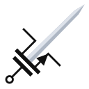
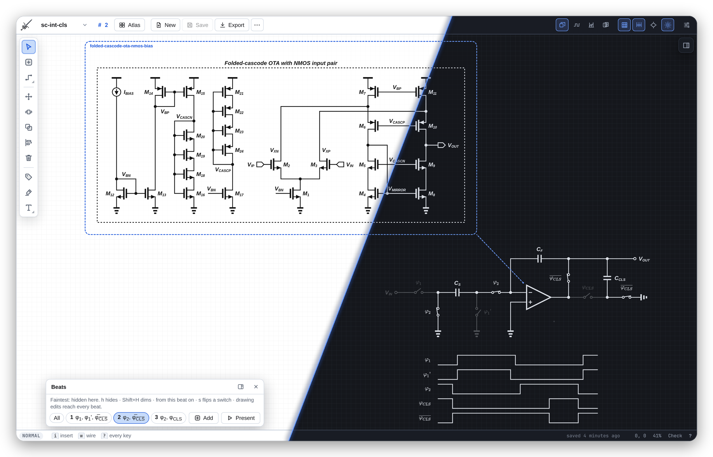
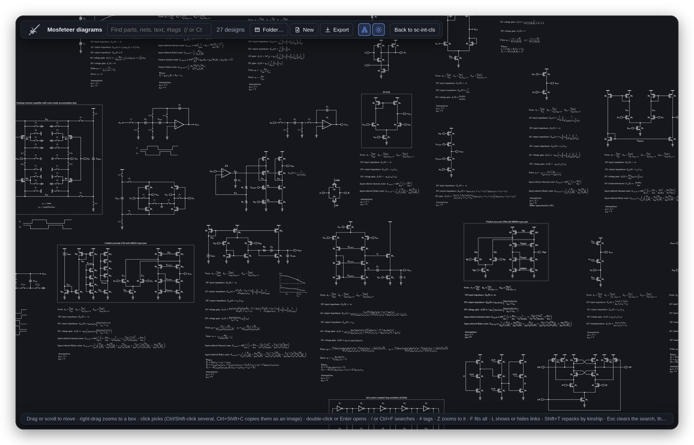

<p align="center">
  <picture>
    <source media="(prefers-color-scheme: dark)" srcset="docs/images/logo-dark.svg">
    
  </picture>
</p>

<h1 align="center">Mosfeteer</h1>

<p align="center">
  <b>Analog circuit design, from sketch to equation.</b><br>
  Draw textbook-quality schematics, walk through them step by step,<br>
  and derive their transfer functions, all from the keyboard.
</p>

<p align="center">
  
  
  
</p>

<p align="center">
  <a href="#quick-start">Quick start</a> ·
  <a href="#what-it-does">What it does</a> ·
  <a href="#keys-worth-knowing">Keys</a> ·
  <a href="#more">More</a>
</p>

<br>

<p align="center">
  
</p>

## What it does

|  |  |
| --- | --- |
| **Draw fast** | Press `i` and type to place a part. Wires route themselves and stay tidy as parts move. |
| **Explain in steps** | Beats show, dim, and hide parts and flip switches over one drawing, driven by a timing diagram. |
| **Derive the math** | Symbolic Z<sub>in</sub>, Z<sub>out</sub>, A<sub>v</sub>, poles, zeros, and noise, each term traced back to its devices. |
| **Work across designs** | Parts link to the circuits they stand for. Peek into them, dive in, or keep another design open in a reference window. |
| **Share it** | SVG, PDF, and PNG export sized for papers, and a browser-only build that runs from a folder. |

<p align="center">
  
  <br>
  <sub><b>The Atlas</b> lays out every design in your workspace on one sheet. Search inside them, follow their links, and open one with a click.</sub>
</p>

## Quick start

All you need is [Node.js](https://nodejs.org/) 18 or newer.

```sh
git clone https://github.com/ojarvin/mosfeteer.git
cd mosfeteer
node launch.mjs
```

The editor opens in its own window and quits when you close it.

- **Windows:** double-click `Mosfeteer.cmd`.
- **Linux or macOS:** `node launch.mjs --install` adds Mosfeteer to the application menu.
- **No Node?** Open [`browser-only/index.html`](browser-only/index.html) directly. In Chrome or Edge it can open a folder of designs and save in place.

## Keys worth knowing

| | |
| --- | --- |
| `i` · `w` | insert a part · draw a wire |
| `Shift+B` · `Shift+K` | beats · timing diagram |
| `Shift+S` | small-signal analysis |
| `Shift+V` | reference windows |
| `Shift+Backspace` | the Atlas |
| `?` | everything else: keys, tutorial, symbols, tips |

## More

<details>
<summary><b>Documents</b></summary>

<br>

Each schematic is one `.json` file, easy to keep in git or send to someone. New designs go to a workspace folder, `~/Documents/Schematics` by default. An open design with no unsaved changes reloads when its file changes on disk, for example after a `git pull`. **Export** (`Ctrl/Cmd+E`) frames the drawing tightly. Pick a page guide (IEEE single or double column) and the text lands at the paper's figure size.

</details>

<details>
<summary><b>Scripting</b></summary>

<br>

The editor, the CLI, and the HTTP API share one command language:

```sh
npm run cli -- amp "add nmos M1 --at 120 120"   # edits <workspace>/amp.json
```

</details>

<details>
<summary><b>Development</b></summary>

<br>

```sh
npm run serve   # dev server with auto-restart at http://127.0.0.1:47280/
npm test
```

- [`AGENTS.md`](AGENTS.md): editor behavior and the symbol specification
- [`docs/atlas.md`](docs/atlas.md) · [`docs/hierarchy.md`](docs/hierarchy.md) · [`docs/beats.md`](docs/beats.md): the Atlas, linked designs, and beats
- [`docs/topological-small-signal.md`](docs/topological-small-signal.md): how the analysis works

</details>

## License

[MIT](LICENSE). The vendored Latin Modern Math font in `src/web/fonts/` keeps its own [GUST Font License](src/web/fonts/GUST-FONT-LICENSE.txt).
